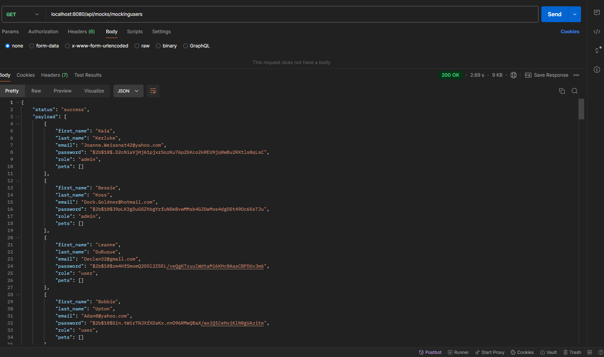

Backend 3

GET

/api/mocks/mockingpets - Genera 50 mascotas sin agregarlas a la base de datos.

/api/mocks/mockingusers - Genera 50 usuarios sin agregarlos a la base de datos

POST 

/api/mocks/generateData?users={cantidadDeseada}&pets={cantidadDeseada} - Genera e inserta datos inventados en la base de datos, especificamente usuarios y pets, se generan cuantos usuarios y pets se indiquen. En caso de no indicar, se generaran 50 aleatorios de users y 50 aleatorios de pets.
