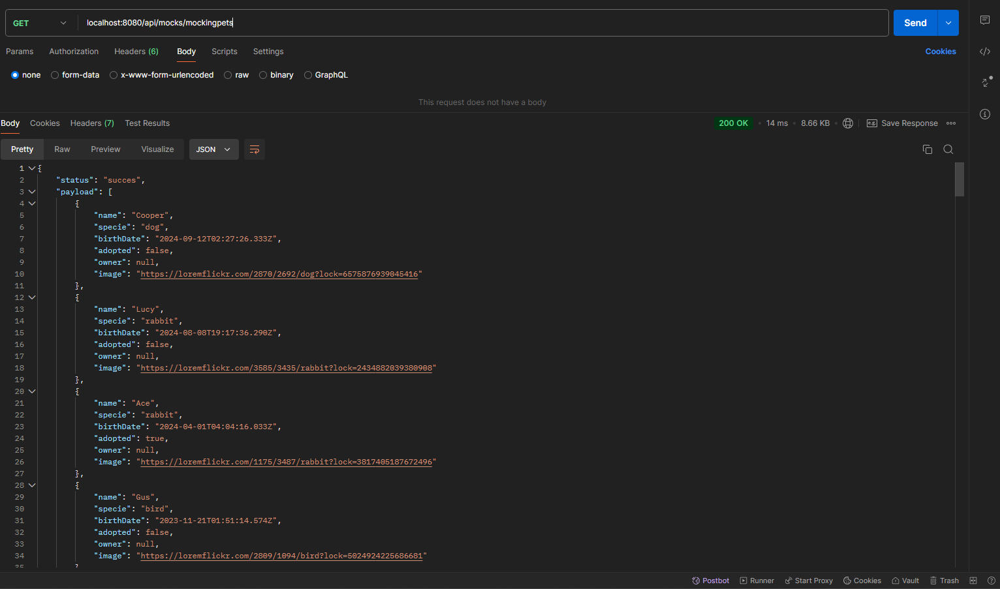

Backend 3

GET

/api/mocks/mockingpets - Genera 50 mascotas sin agregarlas a la base de datos.

/api/mocks/mockingusers - Genera 50 usuarios sin agregarlos a la base de datos

POST 

/api/mocks/generateData?users={cantidadDeseada}&pets={cantidadDeseada} - Genera e inserta datos inventados en la base de datos, especificamente usuarios y pets, se generan cuantos usuarios y pets se indiquen. En caso de no indicar, se generaran 50 aleatorios de users y 50 aleatorios de pets.

Base de datos despues de generar pets y users

TEST

Para ejecutar los tests, correr el comando: npm test

Deberia aparecer esto si se ejecutaron correctamente

DOCKER

Proyecto Dockerizado. Link a la imagen de docker: https://hub.docker.com/r/fedeurano/docker_urano

Pullear el proyecto con el comando: docker pull fedeurano/docker_urano:ver1

Luego correrlo con el siguiente comando:docker run -p 3080:3080 docker_urano 

Para chequear que funciona, ir a: http://localhost:8080/api/users

SWAGGER

Documentancion subida en: http://localhost:8080/api-docs/

